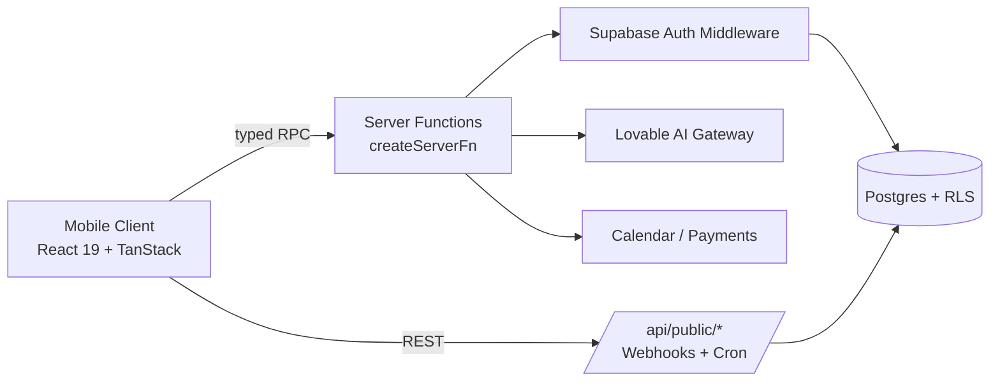

# LinkedIN_Clone

> The professional network MBA students actually need — built for verified cohorts, alumni outreach, and high-signal career moves.

---

## 🚀 Hero

**LinkedIN_Clone** is a mobile-first professional networking app for verified MBA students and alumni. It takes the visual language of LinkedIn and rebuilds the parts that matter most for business school students: **structured alumni outreach, cohort intelligence, and paid Office Hours** — turning vague "let's connect" requests into measurable career outcomes.

- 🎯 **Value:** Convert your alumni network into interviews, referrals, and offers.
- 🧩 **Problem solved:** No more cold "Hi sir, can you refer me?" DMs lost in a recruiter's inbox.
- 📈 **Outcome:** Verified students get faster responses, better referrals, and richer cohort signal.


---

## 🧠 Problem Statement

MBA students live or die by their network — yet the tools they use are built for a generic global audience.

- **Cold outreach is broken.** A 2-line "please refer me" message has <2% reply rate.
- **Alumni are overwhelmed.** Senior alumni get hundreds of unstructured DMs every week.
- **Cohort signal is invisible.** Students don't know what their classmates are winning, applying to, or earning — so prep stays generic.
- **No accountability layer.** There's no way to book, pay for, or track a real mentorship conversation.

LinkedIn optimizes for *everyone*. LinkedIN_Clone optimizes for *the 24-month window where an MBA student needs maximum leverage*.

---

## 💡 Solution Overview

LinkedIN_Clone treats **student ↔ alumni outreach as a first-class product surface** with three differentiating layers:

1. **Intent Picker** — Every "Connect" forces a structured intent: *Referral Ask*, *Office Hours*, *Mentorship*, *Coffee Chat*. Alumni see context, not noise.
2. **My Cohort** — A dedicated tab showing your verified classmates' wins, offers, and benchmarks in real time.
3. **Office Hours** — Premium, bookable 15–30 min slots with verified alumni. Free or paid, calendar-native.

### User Journey

```
Sign up (verified .edu) → Build profile → Browse cohort feed
                                    ↓
Find alum → Tap "Connect" → Pick Intent → Send structured ask
                                    ↓
Book Office Hours → Get referral → Track outcome → Pay it forward
```

### Key Differentiators

|                | LinkedIn          | LinkedIN_Clone                       |
| -------------- | ----------------- | --------------------------------- |
| Verification   | Self-declared     | School-verified students & alumni |
| Outreach       | Free-text DM      | Structured intents                |
| Mentorship     | Ad-hoc            | Bookable Office Hours             |
| Cohort signal  | Hidden in feed    | Dedicated tab + benchmarks        |

---

## ✨ Features

### Core Features
- 🪪 Verified-only network (students + alumni)
- 📰 Mobile-first feed with stories, posts, social proof
- 💬 Focus & Other inboxes to surface high-signal threads
- 🔔 Smart notifications categorized by Referral Ask & Office Hours
- 💼 Job board with one-tap "Ask for Referral"

### 🤖 AI Features
- ✍️ AI post rewrite — turn a draft into a polished thought-leadership post
- 🎯 Intent classifier — auto-suggests the right outreach intent
- 📊 Personalized cohort digest — weekly summary of what classmates are doing

### ⚙️ Automation Features
- 📅 Auto-confirm Office Hours bookings + calendar sync
- 🔁 Mock feed refresh with new cohort posts to drive return engagement
- 🚦 Inbox triage — Focus folder auto-routes high-intent messages
- 🧾 Referral request templates pre-filled per company

### 🎨 User Experience Features
- 📱 True mobile-first design (LinkedIn-inspired dark mode)
- 🧭 Persistent 5-tab bottom nav
- 🟦 LinkedIn blue (`#0A66C2`) primary, OKLCH-themed tokens
- ⚡ Bottom-sheet intent picker — friction-reducing, not friction-adding
- ✅ Verified badge across the surface

### 📈 Admin / Analytics Features
- 📊 Cohort pulse stats (placements, offers, competitions)
- 💰 Salary benchmarks by function (Consulting / Product / Finance / Tech)
- 🧠 Engagement metrics on Office Hours conversion
- 🏷️ Tagging for Referral Asks vs casual chats

---

## 🧱 Tech Stack

| Layer            | Technology                                                            |
| ---------------- | --------------------------------------------------------------------- |
| **Frontend**     | React 19, TanStack Start v1, TanStack Router (file-based)             |
| **Styling**      | Tailwind CSS v4, OKLCH design tokens, shadcn/ui                       |
| **Build**        | Vite 7, TypeScript (strict)                                           |
| **Backend**      | TanStack Start server functions, Cloudflare Workers (edge)            |
| **Database**    | Lovable Cloud (Postgres + Row Level Security)                          |
| **APIs**         | Typed RPC via `createServerFn`, REST routes under `/api/public/*`     |
| **AI / LLMs**    | Lovable AI Gateway (post rewrite, intent classification)              |
| **Hosting**      | Lovable Cloud / Cloudflare edge                                       |
| **Auth**         | Supabase Auth via Lovable Cloud — `.edu` verification flow            |
| **Integrations** | Calendar booking, payments (Stripe-ready), avatars (DiceBear)         |

---

## 🏛️ Architecture / System Design

LinkedIN_Clone runs as an **edge-rendered TanStack Start app** with a thin server-function layer in front of Postgres. The mobile-first client talks to typed server functions; webhooks and cron jobs use public API routes.



### Data Flow
1. Client requests a feed → server function validates auth → RLS-scoped Postgres query → typed response.
2. User books Office Hours → server function writes booking → triggers calendar + notification.
3. Webhooks (payment, calendar) hit `/api/public/*` with signature verification.

### Component Breakdown
- **AppShell / TopBar / BottomNav** — persistent layout
- **IntentSheet** — bottom-sheet structured outreach
- **OfficeHoursCard** — booking surface on profiles
- **CohortFeed** — pulse + benchmarks + filtered classmate posts

---

## 📁 Folder Structure

```
LinkedIN_Clone/
├── src/
│   ├── routes/                # File-based routing (TanStack)
│   │   ├── __root.tsx
│   │   ├── index.tsx          # Home feed
│   │   ├── network.tsx        # My Cohort tab
│   │   ├── post.tsx           # Post composer (AI rewrite)
│   │   ├── jobs.tsx           # Job board + referral asks
│   │   ├── messages.tsx       # Focus / Other inbox
│   │   ├── notifications.tsx  # Categorized notifications
│   │   ├── profile.tsx        # Profile + Office Hours
│   │   └── api/public/        # Webhooks & cron endpoints
│   ├── components/
│   │   ├── Layout.tsx         # AppShell, TopBar, BottomNav, VerifiedBadge
│   │   ├── IntentSheet.tsx    # Structured outreach bottom sheet
│   │   └── ui/                # shadcn primitives
│   ├── lib/
│   │   ├── data.ts            # Mock data (users, posts, jobs)
│   │   └── *.functions.ts     # Server functions
│   ├── integrations/supabase/ # Auth + admin clients
│   ├── styles.css             # OKLCH design tokens
│   ├── router.tsx
│   └── start.ts
├── supabase/migrations/       # DB schema + RLS policies
├── public/
└── package.json
```

---

## 🧭 Usage

### How users interact
1. **Sign in** with verified school email.
2. **Browse** the home feed and your *My Cohort* tab.
3. **Tap Connect** on any alum → choose an intent (Referral / Office Hours / Mentorship).
4. **Book** a 15–30 min Office Hours slot — free or paid.
5. **Track** referral asks and bookings in Notifications & Messages.

### Typical workflow

```
Discover alum → Pick Intent → Book/Send → Get response in Focus inbox → Convert to interview
```

### Example use cases
- 🎓 *Final-year MBA* requesting a referral for McKinsey BA from an alum
- 🧪 *First-year* booking Office Hours with a Bain Senior Consultant before case prep
- 🏆 *Cohort lead* sharing a HUL L.I.M.E win to lift the entire batch's morale
- 💼 *Alum at Flipkart* posting an APM role and pre-filtering applicants by cohort

---

## 🎯 Product Thinking

### Target Personas
| Persona                  | Need                                          |
| ------------------------ | --------------------------------------------- |
| **MBA Student (Y1/Y2)**  | Referrals, mentorship, prep signal            |
| **MBA Alum (1–5 yrs)**   | Give back without inbox overload              |
| **Senior Alum (5+ yrs)** | Monetize Office Hours, hire trusted juniors   |
| **Recruiters / Schools** | Reach verified, intent-tagged talent          |

### Business Value
- **For schools:** higher placement rates + measurable alumni engagement.
- **For alumni:** monetized mentorship + structured giving back.
- **For students:** 10x higher response rate vs cold LinkedIn DMs.
- **Revenue:** paid Office Hours (rev share), recruiter access, school SaaS license.

### Scalability
- Edge-rendered (Cloudflare) — global low-latency for mobile users.
- Postgres + RLS scales horizontally per school tenant.
- Server functions are stateless; AI calls routed via gateway with rate limits.

### Roadmap
- ✅ **V1** — Verified network, Intent Picker, Cohort, Office Hours
- 🔜 **V2** — Group Office Hours, alumni-led cohorts, referral tracking dashboard
- 🔜 **V3** — School admin portal + placement analytics
- 🔮 **V4** — Cross-school network, AI mock interviews, salary intelligence API

### Metrics / KPIs
- 📩 **Outreach response rate** (target: >40% vs LinkedIn ~5%)
- 🗓️ **Office Hours booked / week**
- 🤝 **Referral → interview conversion**
- 🔁 **D7 / D30 retention** on the Cohort tab
- 💰 **GMV** from paid Office Hours

---

<p align="center">Built with 💙 for the next generation of business leaders.</p>
